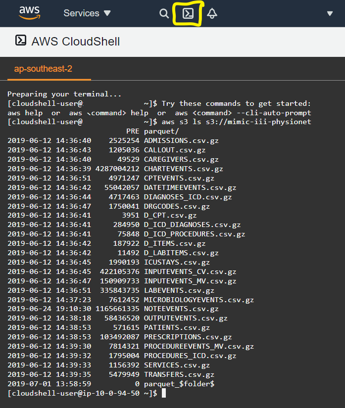
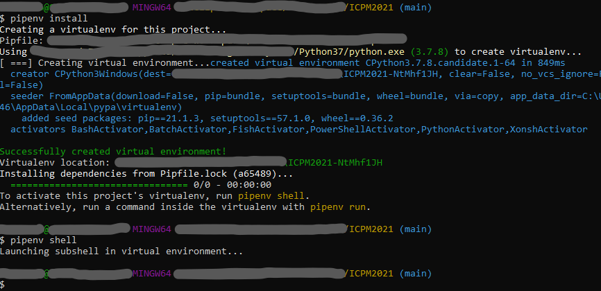

# ICPM2021 - Data Sources
A reproduction repository for MIMIC III ETL

Ensure that you have access to MIMIC III dataset and have completed the required ethics training to be using this publicly available dataset.<br><br>
The MIMIC III dataset and access information can be found at: <br>https://physionet.org/content/mimiciii/1.4/ <br>
If you wanted an in-depth understanding of the data available in this dataset, please refer to the official documentation at: <br>https://mimic.mit.edu/docs/iii/ <br><br>
We assume that you already have access to the data to reproduce the ETL steps for creating two datasets used for a ICPM2021 submission, a movements log and a procedure log. <br>
We also assume that you have an AWS account and are familiar with python, SQL and AWS services. In-depth knowledge of any of these languages are not needed, but some introduction knowledge will be helpful.<br>

## Disclaimer
Note that AWS services are not free. However, AWS does provide a level of freeness below a usage level. Therefore, following these steps to execute the creation of these datasets should not cost more than a dollar in the worst case. <br>
But we do not guarantee that following these steps will not result in a charge to your account.<br>
We recommend using cloud storage and cloud services to use this dataset as it provides universal access across many different types of personal computers available today.<br>

# Step Zero - Get Access 
Johnson has set up access on two cloud services providers, Google and AWS. To access these datasets so that you don't need to download the files locally then reupload them to a cloud service, ensure that you follow the steps below to request access to the dataset already on the cloud service. <br>
Follow steps for AWS : <br> 
(1) https://mimic.mit.edu/docs/gettingstarted/cloud/link/ <br> 
(2) https://mimic.mit.edu/docs/gettingstarted/cloud/request/ <br>

Using the web interface for aws console management, you can check if you have access by using a cloudshell terminal and running the following line of code: <br>

```aws s3 ls s3://mimic-iii-physionet ```

Which should provide the following output back: <br>



# Step One - Create Queryable Interface
Now that we have access to the data, we recommend that you create a copy of the MIMIC-III data set in your local in region if you are not located near us-east-1 (North Virginia).<br>
Before doing so, we require that you setup the AWS cli on your local computer for this step and future steps requiring python scripts.<br>
For more information on the AWS cli see : <br> https://github.com/aws/aws-cli/tree/v2 <br>

For the rest of these steps, we assume that your have a python 3.7+ environment and have installed pipenv for recreate our development environment.
For more information on pipenv see: <br> https://pipenv.pypa.io/en/latest/ <br>

To install the development environment on your local computer, open a terminal and navigate to the root folder and then run the following commands: <br>
```
pipenv install
pipenv shell
```

<br>
You should now have activated a virtual environment matching the original development environment used to generate data sets.
After setting up the development environment and configuring AWS cli for the region which is closest to your self, data/steps/01/copy.py will create a copy of MIMIC-III data set.

run the following command to begin the migration from us-east-1 to your desired region:<br>
```
python "./data/steps/migrate.py" 
```
OR if you are not in the pipenv shell:<br>
```
pipenv run "python" "./data/steps/migrate.py"
```

After running this script sucessfully, a output file will be made, ```data/out/migrate_out.json```. This file is used in future steps and is hashed to managed states between scripts.
Now that we have a local region copy of the mimic-iii dataset, we follow example presented by AWS at: <br>https://aws.amazon.com/blogs/big-data/perform-biomedical-informatics-without-a-database-using-mimic-iii-data-and-amazon-athena/<br>.
Both the difference in compute times (1557s/157s) and cost ($2.97/$0.05) are notable in the example.
However, we have modified their cloud formation template and created a script to handle the launching of these resources.
The cloud formation file can be found [here](data/in/athena_template.yaml), for inspection. 
This will create a athena database and optimised table for each csv in mimic-iii data set.

Run the following commands to create a cloud formation stack, which will deploy all the needed resources to run our ETL scripts over athena.

```
python "./data/steps/construct.py"
```
OR if you are not in the pipenv shell:<br>
```
pipenv run "python" "./data/steps/construct.py"
```
After running this command, if the stack was constructed, a output file will be made at ```data/out/construct_out.json```.<br>
This file is used in the future steps and is hashed to manage states between scripts.<br>
Once you have finished with the querable athena database, you can run the following command to remove the resources allocation.<br>

```
python "./data/steps/remove_stack.py"
```
OR if you are not in the pipenv shell:<br>
```
pipenv run "python" "./data/steps/remove_stack.py"
```
# Step Two - Running Queries
Now that we have a querable interface on AWS, we can run the next group of python scripts to extract and perform some of the transformation steps.

These scripts will require internet access to request athena to run queries and will download the outcome of queries into ```mimiciii/out/```.

The first step to collect exogenous datapoints of interest for this study. 
Run the following command to query for datapoints and create a local copy.
Ensure that you run these commands from the root directory (where this readme.md is located).

```
python ./mimiciii/steps/exogenous.py
```
OR if you are not in the pipenv shell:<br>
```
pipenv run "python" "./mimiciii/steps/exogenous.py"
```

This script will query mimiciii in for a collection of patient observations, then record a single csv for each patient in ```mimiciii/out/exogenous/```.
A record of patients and their identifiers from mimic-iii extracted by this script can found be found in ```mimiciii/out/exogenous/patient_universe.csv```.
Depending on your internet connection, the script will roughly take ~10minutes.

The next step is to collect the control flow perspective for the movements event log. 
This event log considers events to be the movement or requested movement of a patient between ICU wards.
Again this script will query athena in partitions and will output a single csv containing all events for this event log, ```mimiciii/out/movements/controlflow_events.csv```.
Depending on your internet connection, the script will roughly take 10~20minutes.


```
python ./mimiciii/steps/movements.py
```
OR if you are not in the pipenv shell:<br>
```
pipenv run "python" "./mimiciii/steps/movements.py"
```


# Step Three - Transformation of data to XES